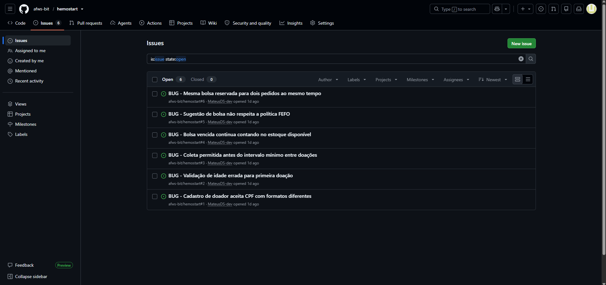

🔧 ```bash install.sh```

🌎 ```hemostart```

#  Entrega 1  Rota Vital 🩸POO

Sistema de gestão de banco de sangue desenvolvido como Projeto Integrador do 3º semestre de ADS (2026.2).

Objetivo: armazenar, controlar e distribuir bolsas de sangue de forma segura e rastreável, conectando doadores, estoque e hospitais.

## Equipe (Hemostart)

- Mateus Henrique Diniz
- Caio Catão
- João Lucas
- Kelly
- Elisa Martins
- Augusto Freitas
- Glauberson
- Daniel Luiz

## Disciplinas integradas

| Disciplina | Contribuição no projeto |
|---|---|
| Projeto | Levantamento de requisitos, histórias de usuário e BDD |
| Programação Orientada a Objetos | Modelagem e implementação das entidades do sistema |
| Algoritmos e Estruturas de Dados | Estruturas para controle de estoque e compatibilidade |
| Estatística e Probabilidade | Indicadores de estoque/demanda e análise probabilística de desabastecimento e descarte |
| Infraestrutura de Software (SO) | Ambiente de execução e implantação |
| Infraestrutura de Comunicação (RSD) | Comunicação entre sistema e hospitais |

## Documentação

- 📄 [Histórias de Usuário (BDD)](docs/historias-usuario-rota-vital.md)
 

## Figma

-https://www.figma.com/proto/CBJbIvf3z3tfEXEEG7daIm/rascunho-rota-vital?t=cgiM3bFyiB5J0S8J-1
  
## Screencast

- https://youtu.be/VbNkdUrYwnA?si=KJtaPPikWFK2a72j

## Relatório de Algoritmos e Estrutura de Dados U1

https://docs.google.com/document/d/1pvN2DdHupPwdKikVTwpOW34SZLH7y-uA_THajAqoH8A/edit?tab=t.0

## Apresentação de Estatística

https://www.youtube.com/watch?v=-s2cwjNmQJ8

# 🎓 Infraestrutura de Software - Unidade 1 (U1)

---

## 1. Atividade Prática: Mesa DJ (Concorrência e Sincronização)

**Descrição:**  
Simulador de uma mesa de DJ controlada via terminal, onde cada instrumento é executado em uma Thread independente, permitindo a reprodução simultânea de múltiplas faixas de áudio com o Pygame.

**Tecnologias:** Python 3.12 + Pygame.

🔗 **Link do Repositório:** [Clique aqui para acessar o projeto Mesa DJ](https://github.com/MateusDS-dev/mesa_dj)

## 2. Módulo de Paralelismo: Threads II (Projeto Hemostart)
Descrição:
Aceleração de uma operação CPU-bound (Validação em Lote de Compatibilidade Sanguínea ABO+Rh) utilizando processamento paralelo com ExecutorService e Virtual Threads do Java 21 (Project Loom).

Tecnologias: Java 21 + Spring Boot 3.2 + Maven + JUnit 5.

🔗 Link do Repositório: Clique aqui para acessar o projeto Threads II (Hemostart)
https://github.com/MateusDS-dev/trhds2.git

---


#  Entrega 2  Rota Vital 🩸POO

## historias atualizadas h09 h10

- 📄 [Histórias de Usuário (BDD)](docs/historias-usuario-rota-vital.md)
 
##-Issue/bug tracker


## Screencast
-https://youtu.be/wTMYO7UHukY
-https://youtu.be/0rAuU5NEjrw

## Status

🚧 Em desenvolvimento
